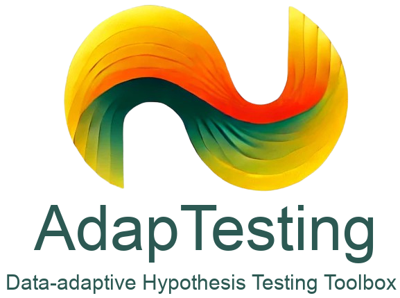

<div align="center">
 
 <h1> <br>AdapTesting: A Data-adaptive Hypothesis Testing Toolbox <br> <br></h1>
</div>


<div align="center"> 

[](https://arxiv.org/abs/1234.56789)
[](https://paperswithcode.com/task/hypothesis-testing)
[]()
[](https://www.python.org/)
[](https://pytorch.org/)
[](https://opensource.org/licenses/MIT)

</div>

## Introduction

Hypothesis testing serves as a fundamental statistical tool in machine learning (two-sample testing, independence testing, etc.). Despite its importance, current implementations face significant challenges: fragmented code across different languages and frameworks, lack of unified standards, and complex integration processes requiring users to download, understand, and modify multiple source code repositories.

To address these challenges, we present ***AdapTesting***, a comprehensive toolbox that unifies state-of-the-art hypothesis testing methods for machine learning applications. Our toolbox simplifies the testing process to its essence: users only need to provide their data and optionally specify the desired testing method name (as we provide the default method for both time-efficiency and power-generability) to receive comprehensive results, including result of testing, p-values, and test statistics. By standardizing implementation in Python and PyTorch frameworks, we ensure GPU-accelerated computations across different computing systems while maintaining a consistent interface.

Our initial release focuses on implementing comprehensive two-sample testing methods, with planned extensions to include independence testing and other frequently used hypothesis tests in subsequent releases. Through AdapTesting, we aim to democratize statistical testing in machine learning by providing a unified, efficient, and accessible framework that bridges the gap between theoretical methods and practical applications.

## Methods for Two-sample Testing - referenced paper

- Median Heuristics - [Large Sample Analysis of the Median Heuristic](https://arxiv.org/pdf/1707.07269)
- MMD-FUSE - [MMD-FUSE: Learning and Combining Kernels for Two-Sample Testing Without Data Splitting](https://arxiv.org/pdf/2306.08777)
- MMD-Agg - [MMD Aggregated Two-Sample Test](https://arxiv.org/pdf/2110.15073)
- MMD-Deep - [Learning Deep Kernels for Non-Parametric Two-Sample Tests](https://arxiv.org/pdf/2002.09116)
- C2ST-MMD - [Revisiting Classifier Two-Sample Tests](https://arxiv.org/pdf/1610.06545)

### Installation and Usage

#### Installation

You can install using `pip` and access it locally:
```bash
pip install git+https://github.com/yeager20001118/AdapTesting
```
or install it from [PyPI](https://pypi.org/) after we release and publish it:
```bash
pip install adaptesting
```

As we are using the Mitra (tabular foundation model) by default, you have to install it by:
```bash
pip install uv
uv pip install autogluon.tabular[mitra] 
```

#### Datasets for Two-sample Testing
You can load some frequently used datasets (for tabular, image and text) directly from our package. More examples can be found in the [datasets examples](./examples/main_example.ipynb), and we will keep updating the datasets. 
```Python
from adaptesting import datasets

# Tabular HDGM datasets
hdgm = datasets.HDGM(N=500, M=500, level="easy")
X, Y = hdgm()
# Visualize HDGM's first 2 dimension
plt.plot(X[:, 0], X[:, 1], 'o')
plt.plot(Y[:, 0], Y[:, 1], 'o')
plt.show()
```


```Python
from adaptesting import datasets

# Image Cifar10 VS. Cifar10.adv datasets
cifar_adv = datasets.CIFAR10Adversarial(N=100, M=100, attack_method='PGD')
X, Y = cifar_adv()
# Visualize Cifar10's original image, and its adversarial attacked image
imshow(X[:25].permute(1, 2, 0))
imshow(Y[:25].permute(1, 2, 0))
plt.show()
```


```Python
from adaptesting import datasets

# Text Human-written text VS. Machine-generated text datasets
hc3 = datasets.HC3(N=100, M=100)
X, Y = hc3()
# Visualize hwt and mgt
print(X[0])
print(Y[0])
```

```txt
# HWT
Basically there are many categories of " Best Seller " . Replace " Best Seller " by something like " Oscars " and every " best seller " book is basically an " oscar - winning " book . May not have won the " Best film " , but even if you won the best director or best script , you 're still an " oscar - winning " film . Same thing for best sellers . Also , IIRC the rankings change every week or something like that . Some you might not be best seller one week , but you may be the next week . I guess even if you do n't stay there for long , you still achieved the status . Hence , # 1 best seller .
```

```txt
# MGT
There are many different best seller lists that are published by various organizations, and the New York Times is just one of them. The New York Times best seller list is a weekly list that ranks the best-selling books in the United States based on sales data from a number of different retailers. The list is published in the New York Times newspaper and is widely considered to be one of the most influential best seller lists in the book industry. 
It's important to note that the New York Times best seller list is not the only best seller list out there, and there are many other lists that rank the top-selling books in different categories or in different countries. So it's possible that a book could be a best seller on one list but not on another. 
Additionally, the term "best seller" is often used more broadly to refer to any book that is selling well, regardless of whether it is on a specific best seller list or not. So it's possible that you may hear about a book being a "best seller" even if it is not specifically ranked as a number one best seller on the New York Times list or any other list.
```


#### Example usage of Two-sample Testing

The detailed demo examples (for tabular, image and text data) can be found in the [examples](./examples) directory.

```Python
from adaptesting import tst # Import main function 'tst' from package 'adaptesting'

# Example synthetic input data
import torch
from torch.distributions import MultivariateNormal
mean = torch.tensor([0.5, 0.5])
cov1, cov2 = torch.tensor([[1.0, 0.5], [0.5, 1.0]]), torch.tensor([[1.0, 0], [0, 1.0]])
mvn1, mvn2 = MultivariateNormal(mean, cov1), MultivariateNormal(mean, cov2)

# Replace X, Y to your own data, make sure its type as torch.Tensor
X, Y = mvn1.sample((1000,)), mvn2.sample((1000,)) 

# Five kinds of SOTA TST methods to choose：
h, mmd_value, p_value = tst(X, Y, device="cuda") # Default method using median heuristic, device can be either "cuda", "cpu" or "mps"

# Other available methods and their default arguments setting (uncomment to use):
# h, mmd_value, p_value = tst(X, Y, device="cuda", method="fuse", kernel="laplace_gaussian", n_perm=2000)
# h, mmd_value, p_value = tst(X, Y, device="cuda", method="agg", n_perm=3000)
# h, mmd_value, p_value = tst(X, Y, device="cuda", method="clf", data_type="tabular", patience=150, n_perm=200)
# h, mmd_value, p_value = tst(X, Y, device="cuda", method="deep", data_type="tabular", patience=150, n_perm=200)

"""
Output of tst: 
    (result of testing: 0 or 1, 
    test statistics value of two samples, 
    p-value of testing)

If testing the two samples are from different distribution, the console will output 
    'Reject the null hypothesis with p-value: ..., the test statistics for {method} is ...'.
Otherwise,
    'Fail to reject the null hypothesis with p-value: ..., the test statistics for {method} is ...'.
"""
```

### Performance of Two-sample Testing methods

Performance evaluations and benchmarks across tabular, image, and text data can be found in the [examples](./examples) directory.

- Test Power: Ability to correctly reject H0 when false (higher is better)
- Type-I Error: Rate of falsely rejecting H0 when true (should be $\leq \alpha$, the significance level)
- Running Time: Computational time in seconds

<!-- ### Method Descriptions:

1. **Median-Heuristic**: Classic MMD test with median-based kernel bandwidth
2. **MMD-Fuse**: MMD with multiple kernel bandwidths
3. **MMD-Agg**: Aggregated MMD test across different kernels
4. **MMD-Deep**: Deep kernel MMD with neural network learned features
5. **C2ST-MMD**: Classifier two-sample test with MMD statistic -->

## Future Features
We are still working on providing the toolbox functionality for other hypothesis testings, e.g., **independence testing**, **conditional independence testing**, **relative testing** and **distribution closeness testing**.

## Contributors
This work is done by
- Xunye Tian (UOM), [xunyetian.ml@gmail.com](xunyetian.ml@gmail.com)
- Zhijian Zhou (UOM), [zhijianzhou.ml@gmail.com](zhijianzhou.ml@gmail.com)
- [Dr. Feng Liu](https://fengliu90.github.io/) (UOM), [fengliu.ml@gmail.com](fengliu.ml@gmail.com)


